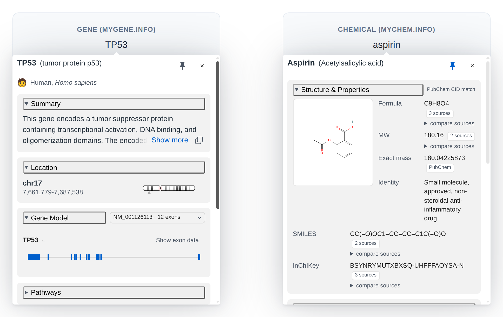

# Bio Tooltips

Framework-agnostic biological & biochemical tooltips for HTML documents.

<p align="center">
  <picture>
    <source media="(prefers-color-scheme: dark)" srcset="assets/preview-dark.png">
    
  </picture>
</p>

Bio Tooltips provides shared tooltip behavior plus entity-specific tooltip modules for genes, chemicals, and future biology-related entities such as variants.

Currently supported modules:

- Gene tooltips via [MyGene.info](https://mygene.info)
- Chemical tooltips via [MyChem.info](https://mychem.info)

## Install

```bash
npm install bio-tooltips
```

Import the shared stylesheet once:

```ts
import 'bio-tooltips/style.css';
```

## Gene Tooltips

Use the MyGene.info adapter for gene symbols, species-aware lookup, summaries, pathways, transcripts, structures, and gene model visuals.

```html
<span class="gene-tooltip" data-species="human">TP53</span>
<span class="gene-tooltip" data-species="mouse">Trp53</span>
```

```ts
import { GeneTooltip } from 'bio-tooltips/mygene';

GeneTooltip.init({
  selector: '.gene-tooltip'
});
```

## Chemical Tooltips

Use the MyChem.info adapter for chemical names, stable identifiers, structures, properties, pharmacology, safety notes, and source-aware records.

```html
<button type="button" class="chemical-tooltip" data-query="2244" data-scope="pubchem">aspirin</button>
<span class="chemical-tooltip" data-query="CHEMBL25" data-scope="chembl">aspirin</span>
```

```ts
import { ChemicalTooltip } from 'bio-tooltips/mychem';

ChemicalTooltip.init({
  selector: '.chemical-tooltip'
});
```

## Root Import

The root package exports the current tooltip modules:

```ts
import { GeneTooltip, ChemicalTooltip } from 'bio-tooltips';
```

Subpath imports remain preferred when an application wants to load only one tooltip module.

## Programmatic Adapters

Visualization adapters can attach a tooltip directly to one real DOM element and control it through a small handle:

```ts
const handle = GeneTooltip.attach(anchor, { visualPreload: 'none' });

// Update the existing anchor before opening; its current text and data attributes are read on each open.
anchor.textContent = 'TP53';
anchor.dataset.species = 'human';
handle.open({ focus: false });

handle.close();
handle.destroy(); // removes the tooltip and restores the anchor's original accessibility attributes
```

`ChemicalTooltip.attach(anchor, config)` works the same way. Its query comes from the anchor's current `data-query` value, or its text when that attribute is absent, and its lookup context comes from the current `data-scope` and `data-lookup` attributes. The optional config has the same shape as the corresponding `init()` config. `open()` opens immediately and leaves focus where it is by default; pass `{ focus: true }` to move focus into the dialog. Normal hover and keyboard interactions on the anchor remain available.

The returned `TooltipHandle` type exposes only `open(options?: TooltipOpenOptions)`, `close()`, and `destroy()`. Reopening with unchanged query and context reuses fetched data; changes to either are parsed and looked up on the next open.

## Documentation

Full documentation and examples are available in the `docs` folder and at the project site:

https://mattjmeier.github.io/bio-tooltips/

Span triggers receive keyboard focus and button semantics automatically. Enter or Space enters a named, non-modal details dialog; Tab reaches its controls and Escape dismisses it. Native links retain Enter navigation and use ArrowDown to enter the panel.

Accessibility support, integration responsibilities, tested behavior, and current limitations are documented in [`docs/accessibility.md`](docs/accessibility.md). Bio Tooltips is designed to support WCAG 2.2 Level AA conforming implementations when used according to that guidance; this is not a claim that every integration or the package itself has completed a full WCAG conformance evaluation. The browser regression fixture uses the dev-only `axe-core` package; it is not part of the published runtime or dependency surface.

## Performance Benchmarks

Run the reproducible renderer and controlled cache/prefetch benchmark with:

```powershell
npm run benchmark
```

It produces raw JSON plus publication-ready Markdown tables under
`benchmark/results/`. See the performance benchmarking guide in `docs/performance.md`
for methodology and fixture refresh instructions.

## Supply Chain Notes

Bio Tooltips keeps its user-facing dependency surface intentionally small:

- Required runtime npm dependencies: none.
- Accessibility test tooling: pinned `axe-core` is a development dependency used with Playwright; it is excluded from runtime bundles.
- Bundled positioning foundation: `@floating-ui/dom`; consumers do not install or configure it separately.
- Optional peer dependencies: `d3`, `ideogram`, and `@rdkit/rdkit`. These are not bundled into the package and are only needed for optional visual/structure-rendering features.
- Published package contents: `dist`, `assets` (light + dark README preview images), `README.md`, `LICENSE`, and `package.json`.
- External data/API sources used at runtime: MyGene.info for gene records, MyChem.info for chemical records, and PubChem image URLs for chemical structure images.

The release workflow installs from `package-lock.json` with `npm ci` and publishes to npm with provenance. For browser CDN usage, prefer a pinned package version instead of `@latest`.

## Migrating From gene-tooltips

Replace package imports:

```ts
import { GeneTooltip } from 'gene-tooltips/mygene';
```

with:

```ts
import { GeneTooltip } from 'bio-tooltips/mygene';
```

Browser CDN paths also move to the new package and artifact names:

```html
<link rel="stylesheet" href="https://cdn.jsdelivr.net/npm/bio-tooltips@2.2.0/dist/bio-tooltips.css">
<script src="https://cdn.jsdelivr.net/npm/bio-tooltips@2.2.0/dist/bio-tooltips.global.js"></script>
```

## Package History

This package was originally developed as `gene-tooltips` and renamed to `bio-tooltips` as chemical and future entity modules were added.
